= Idnadrev tour
:toc:

Idnadrev is thought of as an task management tool that helps you with your work on your computer.

Currently in version 0.4 only the task management is implemented. +
In 0.5 basic information management will be included. +
In 0.6 (or maybe even 0.5) synchronizations will be included. +
All in all this is still a really early version but you can give it a try. +
Due to automated integration testing with travis and a local jenkins most commits are ready to use. +
I was able to do incremental changes to the internal database schema from version 0.3 to 0.4. +
However I broke this with the now upcoming development for 0.5. +
So in non developer speek: a new 0.x version might brake your data. *Export* and *import* it before and after an update! +
Only with the release of version 1.0 you will have a stable release that you can use for a long time :) +

If you are looking for a download, there is non, you have to build it yourself:

* install http://www.oracle.com/technetwork/java/javase/downloads/jdk8-downloads-2133151.html[jdk8u20 or later]
* download https://github.com/krampenschiesser/idnadrev/archive/master.zip[idnadrev]
* run idnadrev on the fly with
[source,bash]
gradlew run

* create a distribution with
[source,bash]
gradlew distzip

== Collecting thoughts

You usually have a lot of ideas, receive input by mail or from collegues.

All this stuff is collected as a thought.
In this case I want to create a new sleeping back:

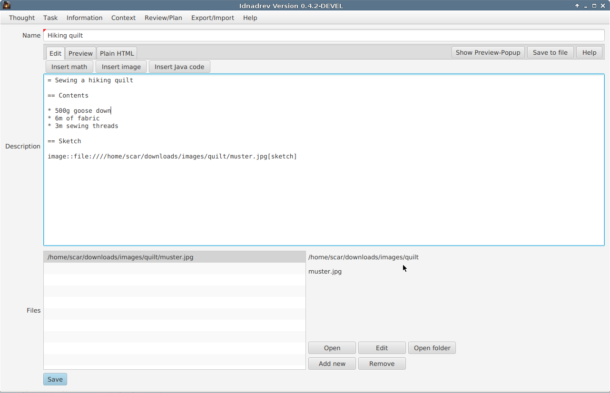

Idnadrev heavily relies on link::http://asciidoctor.org/[asciidoctor].
Asciidoctor is as simple but incredibly powerful markup language.
Therefore almost everything you can edit/write uses the asciidoc editor.
This editor provides an immediate preview of the written stuff:

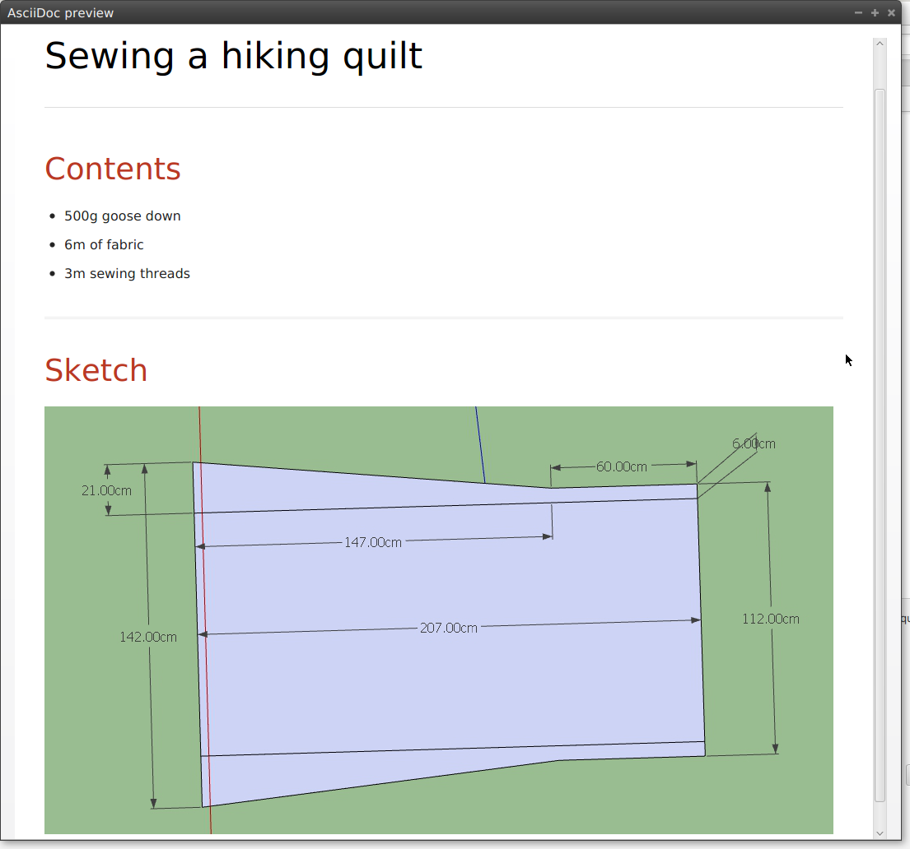

Besides simple text you can attach any file to the thought.
And if it happens to be an image, you can directly include it into the asciidoc document.

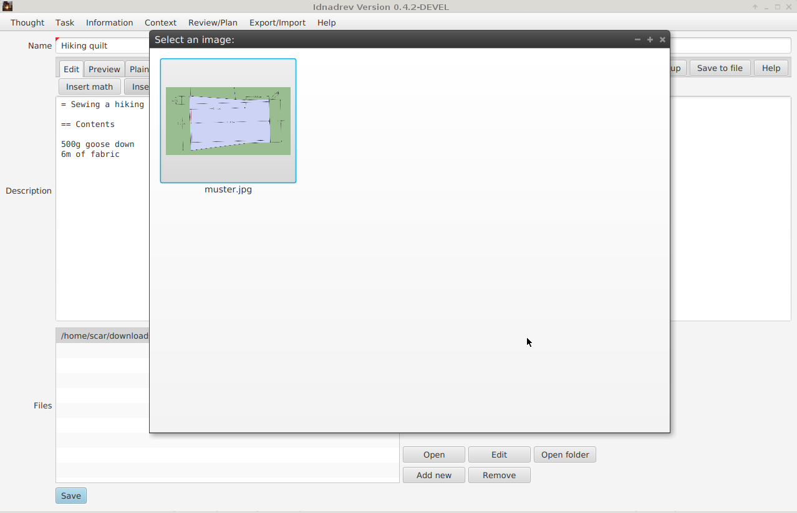

Oh, did I mention that you can render math formulas via mathjax and asciimath?

== Reviewing thoughts

Once you collected your thought you might want to process them further and decide what to do with them.
You can either create tasks or projects from them, delay them further or turn them into information.

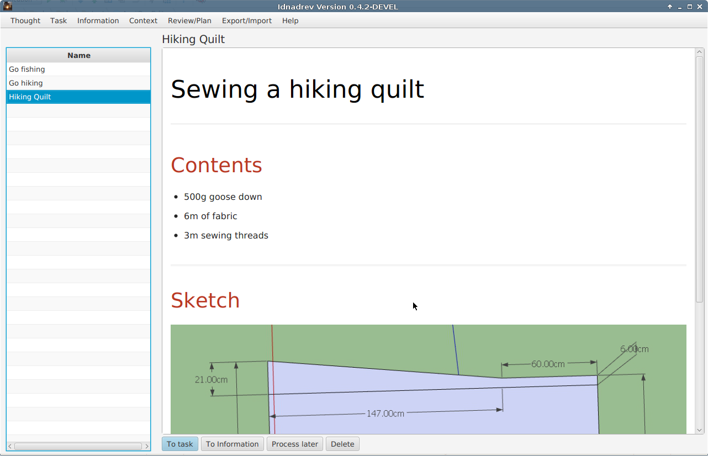

== Creating tasks

You can either turn your thought into a task, or just directly create a new one.
You can mark a task as *project*, assign a task as *subtask* to a project etc. all the common stuff.
A task has a state which can be set to *later* *asap* *delegated* *none* this helps to keep your tasks view clean.
Additionally you can assign a *context* to a task.
This helps to group tasks, that belong logically together
or can only be done at a specific location.
If a task is not a project it should have an estimated time.
This helps you to further plan your tasks/week.

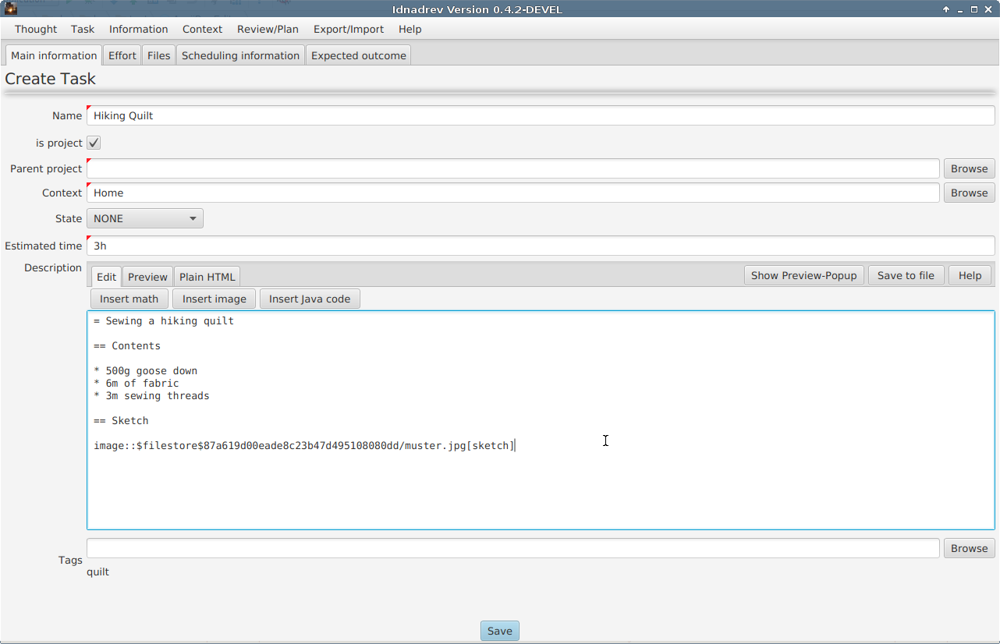

Additionally you can specify a tasks effort in terms of *fun*, *mental-* or *physical-effort*.
A task can be *scheduled*. There are two kinds of task scheduling:

* The *proposition*, this is when you decide to do a task in the next week, or maybe on a specific day of the week.
    But you don't exactly plan any date or time for it.
* The *due date*, this is the classic understanding of a date and time when a task starts.

== View your tasks

The tasks view provides you with a tree of all projects and their tasks.
Finished tasks are not shown.

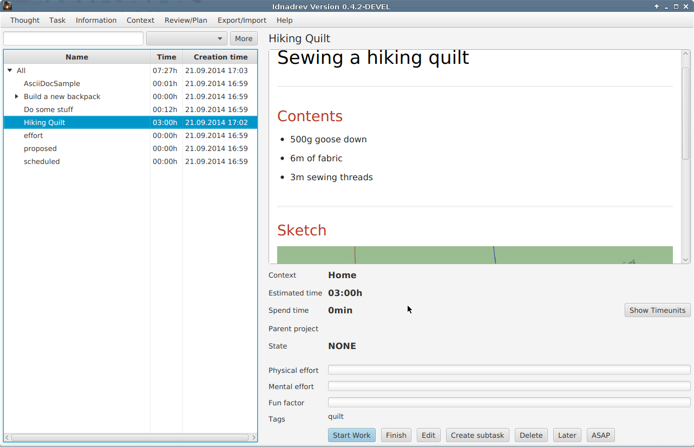

Of course you can filter the tasks to refine your view.
You can quickly select a context from the drop down menu or filter for a task name.
If this is not enought you can go to the enhanced filter page.

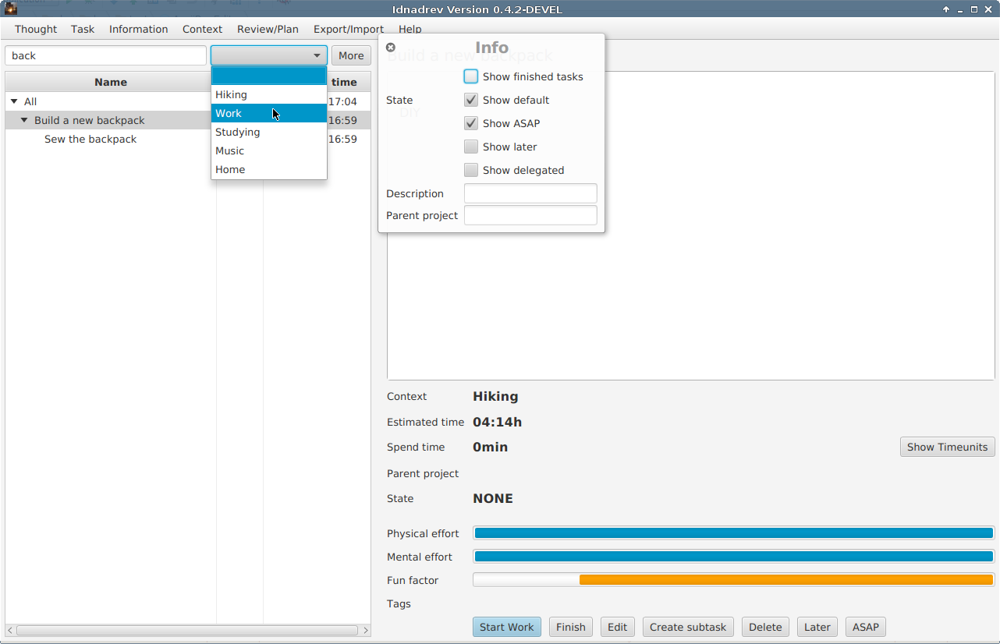

== Plan your week

If you have a lot of tasks and want to get a little bit of order into them you can plan your week ahead.
You have the same task list as in the tasks view.
Just drag and drop the tasks from the list into the week.
Depending on the zoom level (ctrl+mouse wheel) you can choose more specific times.
The bar on the bottom is used for proposition.
This means the task should be done at that day, but it doesn't matter when.

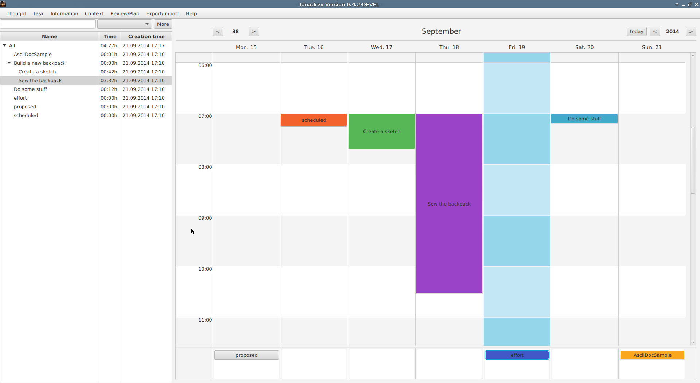

== Review your week

When you review the last week there is also a view which shows you what you have done at which time.

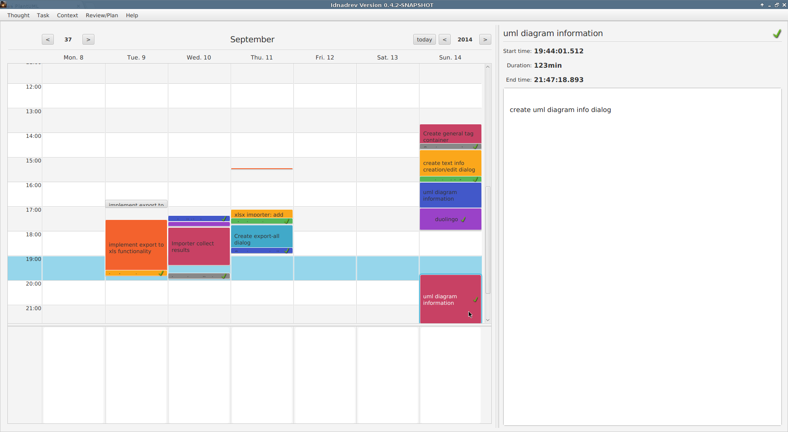

Of course you can zoom in to view the small tasks, too.

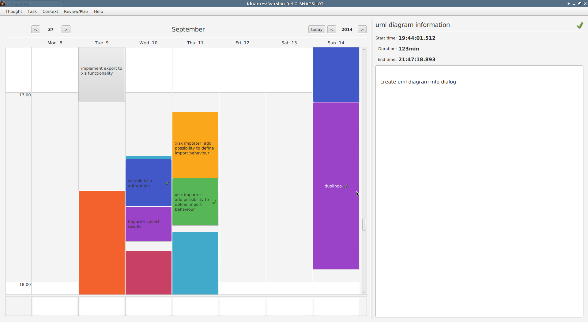

== Work on task

At some point you want to work on a task. Then you simple press *Start work* in the tasks view.
Now idnadrev tracks the spent time so you can see it in the reviews and know when you need more time then expected.

image::img/workontask.png[Work on task]

== Fast task tracking

Fast tracking is a bit of a convinience method. If you are disturbed by a phone call or just do something you haven't planned,
you can use fast task tracking to create a task on the fly on which you work.

== Diary

If you want to keep track of your days there is an integrated diary functionality.

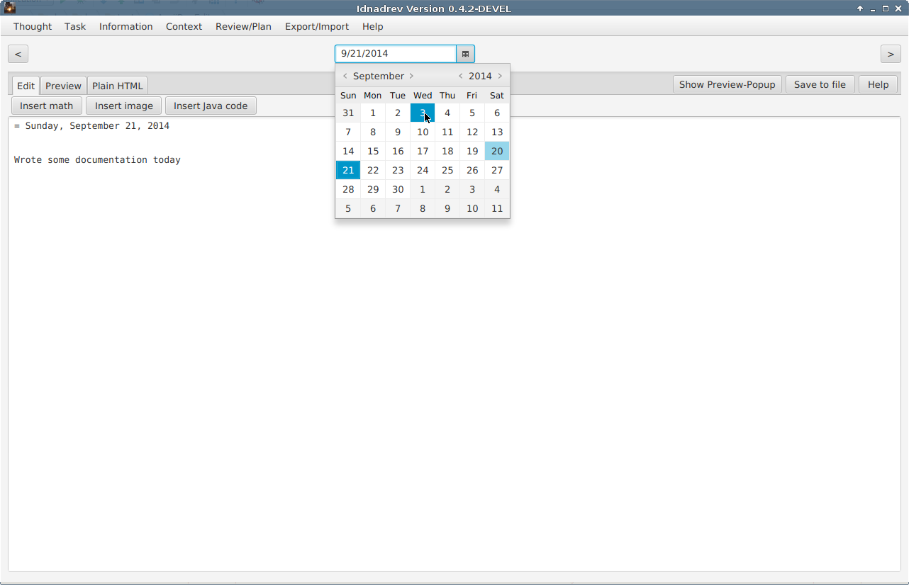

== The information system

Idnadrev is aimed as a simple information storage tool.
So besides your tasks you can store any file or idnadrev specifc information.
The following types of specifc information exist:

* document, the document is a simple asciidoc document, but way more powerful than you think
* uml diagram, an uml diagram, based on the http://plantuml.sourceforge.net/index.html[plantuml] drawing library
* charts, simple javafx charts to graph information
* files, ok this is clear
* hyperlink, bookmark

Information is also *taggable* and can be *categorized*

=== Document

The document is simply an asciidoc document.
But you can include images, galleries, created uml-diagrams or charts.
In conjunction with the synchronization mechanism this is getting more than powerful.

=== UML Diagram

A uml diagram is based on the http://plantuml.sourceforge.net/index.html[plantuml] drawing library.
You use their syntax to generate a diagram. It is a drawing library only.
This is not your full fledged extensible UML editor.
It is aimed at the poor gui that has to show a usecase or classdiagrams in the meeting that is in 5 minutes.
During that time you might just have started your uml editor and done the first clicks while with idnadrev you just wrote
the 20 lines needed for the diagram.

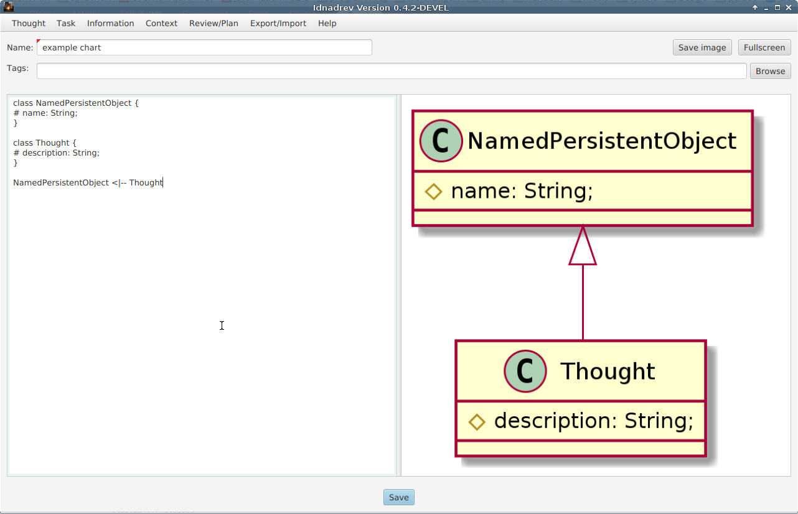

=== Charts

Charts are simple javafx charts you can create for a document or whatever.

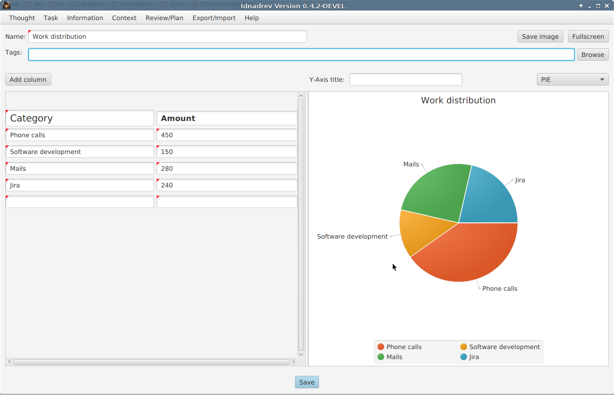

You can easily switch the type of the diagram, add columns, rows etc.

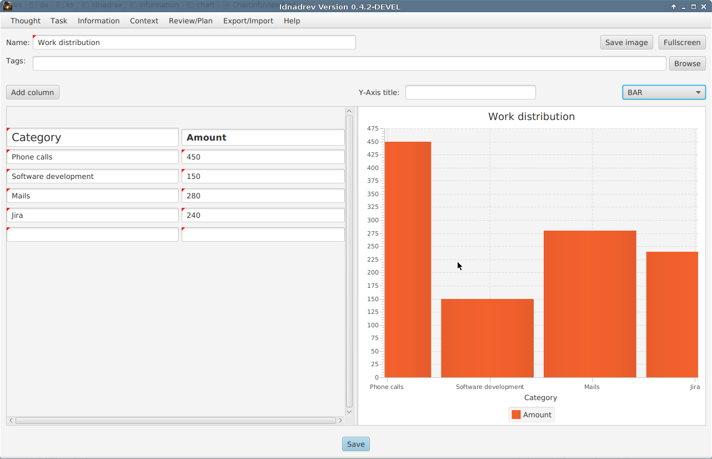

== The synchronizations

Synchronizations are the link to the external world
The following is planned:

* Google calendar synchronization (read from and write to)
* Google tasks synchronization (pull tasks from gtasks or share specific tasks with gtasks)
* Github synchronization (get new issues from github, reject issues, sync a task with github in order to create an issue for it)
* Wordpress synchronization (synchronize with wordpress and publish *Documents* as blog posts

However I am still working on some security related topics which is why the synchronizations are still not in there.

== Ideas for the future

* Presentation information (consiting of Documents, Diagrams, charts) with export to pptx
* Cost module
* Inventory module